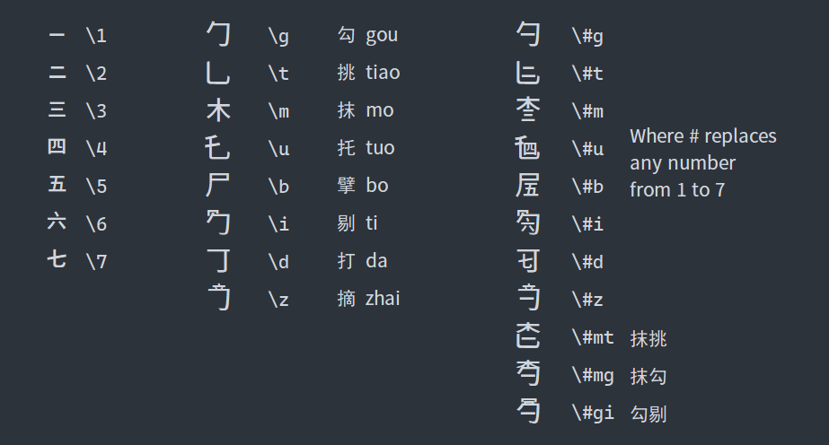

# 思源琴黑 Noto Qin Jianzipu

#### 古琴减字谱字体

- [前言 Introduction](#前言-introduction)
- [说明 Overview of Use](#说明-overview-of-use)
- [字码 Notation](#说明-overview-of-use)
- [Attribution](#attributions)

## 前言 Introduction

本字体是一个基于思源黑体的减字谱字体。本字体只包括拉丁字母，以及减字谱字符，以免字体过大。

**减字谱是用合字符（Ligatures）而写**，若您所用的软件没有合字功能，或者没开启合字功能，则不会显示减字谱。

本字体基本上只有下述的字符，这并非是所有所存在的减字谱，**所以如果缺一个，请发个Issue**。

This is a sans-serif font for writing [Jianzipu](https://en.wikipedia.org/wiki/Guqin_notation), based off Noto Sans SC. This font only includes latin glyphs and qin font ligatures. 

**Ligatures are used to type jianzipu**, if your software/word processor does not support ligatures or does not have them enabled, this will not work.

Generally only the Jianzipu characters detailed below are included, **please make an issue if you need any more characters**, I recognise this is not a complete set.

## 说明 Overview of Use

每一字部都起于一个命令字符，如斜后杠 `\`、斜杠 `/`、联号 `-` 等等，加所需要的字码。

一个减字谱字符可以由多字部拼起，比如「大指7徽6分勾7弦」所需要的字部是：勾7弦、大指、7徽、6分四个，字码是：`\7g/da/7^6`。先输下面的「底部」字部（勾7弦），然后再加后缀，中间不要加空格。后缀可以以任何顺序加上。

若要输撮，可以将两个减字谱用 `||` 并在一起，双方不要加空格，否则字距会出错。

Every character component starts with a command character, such as backslash, forward slash, hyphen, etc. followed by the required character  code.

One jianzipu character is made up of many components, so a 「大指7徽6分勾7弦」 is split into the right hand fingering and position, the left hand fingering, the hui number, and the hui fraction: `\7g/da/7^6`. The base character block is written first and all modifiers are added on, with no spaces.

For combining characters such as 撮, use two vertical bars and make sure to have no spaces between the characters being combined, otherwise the spacing will be wrong.

## 字码 Notation

- [Base blocks](#斜后杠-backslash)
- [Middle blocks](#联号-dash)
- [Modifier Symbols](#斜杠-forwardslash-与--补字号-caret)
- [Combining Characters](#合号-combining-characters)

### \\ 斜后杠 Backslash

斜后杠指「底部」，指右手指法与所弹之弦的部分。

Backslash commands refer to body blocks, those which describe the right hand technique, along with string number.

「`#`」代表一个 1 到 7 的数字。

还有一些左手、特殊字符用斜后杠写：

There are also several special/left hand technique symbols written with backslash:

历、散#如一如何加数字见下方。

### `-` 联号 Dash

联号指上下滑、中下小数字。 Dashes represent the middle small numbers used for movement or 历.

外 部不能与其他数字一块用。

### `/` 斜杠 Forwardslash 与 `^` 补字号 Caret

用于左手指法、徽位，以及散、就、泛、绰、注等标志。

Used in left hand fingering and position, as well as general techniques including 散、就、泛、绰、注.

### `||` 合号 Combining Characters

撮（及反撮）是将两个字符合在一起。以下的是要放在两个字符之间。

撮 combines two jianzipu blocks, and goes in the space between them.

## Opening and Editing

The otf can be downloaded from releases when available.

This font is made using fontlab. You will require fontlab to open the source vfc file. Alternatively you can open the font file itself using another program.

This font does not come with any Han character glyphs so it is advised to also download Noto Sans SC separately if you want to add to it.

## Attributions

Noto Sans SC is the base font, and is licensed under the [SIL Open Font License](https://scripts.sil.org/cms/scripts/page.php?site_id=nrsi&id=OFL) and this is also licensed accordingly. The base font is also in this repository (for convenience). 

>  You can use them freely in your products & projects - print or digital, commercial or otherwise. However, you can't sell the fonts on their own.

> This isn't legal advice, please consider consulting a lawyer and see the full license for all details. 

The Jianzipu decomposition method is entirely my own. Please attribute me if you are going to use my method as a basis of your work.
